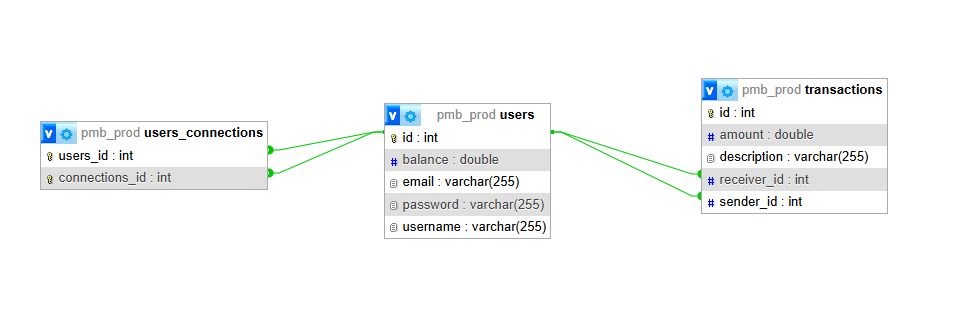

# Pay My Buddy

Ce code est le prototype pour une application qui permettrait aux clients de transférer de l'argent pour gérer leurs finances ou payer leurs amis

Language :

- Java ;
- Spring Boot ;
- Thymeleaf.

Base de donnée :

- Sql.

Test :

- JUnit ;
- Mockito ;

## L'application

Pour l’application, j'ai crée :

- une **couche DAL/référentiel** pour interagir avec les tables de la base de données ;
- une **méthode sécurisée de connexion** à la base de données depuis le code ;
- la **gestion des transactions** (commits et rollback) ;
- **l’interface web** pour le prototype du projet se basant sur les maquettes et exploitant la couche DAL.

## les maquettes 

[maquettes figma](https://www.figma.com/design/F1lT4ZCJwvVjkMk5WSVZbR/Maquettes---Pay-My-Buddy?node-id=0-1&node-type=CANVAS&t=rAjA4FTi9igB20IR-0)

Ajustement réalisé :

- ajout du montant disponible au dessus du montant à transférer sur la page Tranfert ;
- modification de la tables des transactions en modifiant la colonne `Relation` par `Emetteur` et `Receveur` pour plus de clarté sur la page Transfert ;
- la page Profil est non fonctionnel pour ce prototype.

## Le modèle physique de donnée

